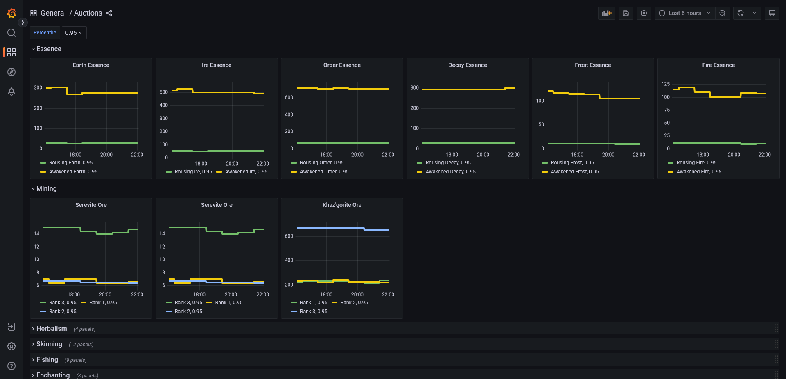

# wow-auction

A set of Grafana dashboards for World of Warcraft _commodities_. Goal is to look like stock charts.

Blizzard calls these items _commodities_, and they have a special API endpoint and are able to be
traded cross-realm. These seem to be the lifeblood of the economy.

For the charts, I focus on reagents.

## Running

1. Copy `template.env` to `.env` and fill in the values for the variables there. You'll need a
   Blizzard Client API ID and secret, which you can create
   [here](https://develop.battle.net/access/clients).
2. Run `make up` to start the docker compose. Once the item cache is filled in (this repo ships with
   a prepopulated one by default), then navigate to <http://localhost:3001>.

   `make down` and `make restart` shut down and restart the containers.

## How it works

1. Pull all the auctions on Blizzard's WoW commodity endpoint at
   [/data/wow/auctions/commodities](https://develop.battle.net/documentation/world-of-warcraft/game-data-apis).
2. Because these auctions have only item IDs, fill in the name, quality, rank, etc from our sqlite
   cache, stored at `cache/item.db`. To fill the cache for the first time, we scrape Wowhead. Note
   the cache is persisted to disk, so we only will have to scrape once per item.
3. Insert the populated auctions into VictoriaMetrics, our metrics backend.
4. Visualize those metrics with grafana.
5. Repeat on some frequency of seconds.

## Item "Rank"?

You know... the new system in Dragonflight where a given item can be of a different
quality/rank/tier. The higher the quality/rank/tier, the better the item (or outcome if used as a
reagent).

Even Blizzard can't figure out what they want to call this. In tooltips, they call it "quality",
but that term is already defined: poor/common/uncommon/rare/epic/etc.

Many players call it _rank_, so we'll use that.

For example: Serevite Ore

- Rank 1: <https://www.wowhead.com/item=190395/serevite-ore>
- Rank 2: <https://www.wowhead.com/item=190396/serevite-ore>
- Rank 3: <https://www.wowhead.com/item=190394/serevite-ore>

Note: These are 1-indexed (while quality is 0-indexed).

## Notes

commodities endpoint gives us auctions with:

- item id
- gold price
- quantity
- time left

but, to be useful, i also want:

- item name (source: blizz API or wowhead)
  - item quality (source: wowhead)
  - item rank (source: wowhead)
- version added (source: wowhead, blizz API, ItemVersion DB)

metrics (gauge type) should then look like

- timestamp: 1583865146520 (unix time)
- value: 5.6523 (means 5 gold, 65 silver, 23 copper)
- labels:
  - id: 12345
  - name: "The Unknown Item"
  - major: 10
  - minor: 1
  - patch: 5
  - build: 345767
